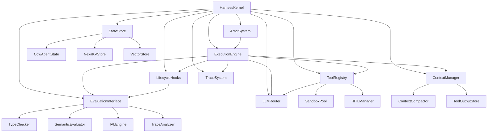

# Nexa v2.0 — Harness Native Runtime Architecture

> 本文档定义 Nexa v2.0 运行时层的完整架构设计，重点阐述 Harness 六元组 $H = (E, T, C, S, L, V)$ 的运行时实现，以及新增的 LLM Router、Actor System、Trace System 等核心组件。

---

## 1. 运行时架构总览

### 1.1 从 v1.x 运行时到 v2.0 Harness Runtime

v1.x 运行时是一组松耦合的 Python 模块，每个模块独立实现一个功能（agent、memory、orchestrator 等），没有统一的 Harness 框架将它们串联。

v2.0 运行时以 **HarnessKernel** 为核心，所有模块通过 HarnessKernel 的生命周期管理进行协作：

```
┌─────────────────────────────────────────────────────────────────────────┐
│                    Nexa v2.0 Harness Runtime                             │
├─────────────────────────────────────────────────────────────────────────┤
│                                                                          │
│  ┌──────────────────────────────────────────────────────────────────┐   │
│  │                    HarnessKernel (核心调度器)                      │   │
│  │                                                                    │   │
│  │  ┌─────────┐  ┌─────────┐  ┌──────────┐  ┌─────────┐           │   │
│  │  │ E: Loop │  │ T: Tool │  │ C: Ctx   │  │ S: State│           │   │
│  │  │ Engine  │  │ Registry│  │ Manager  │  │ Store   │           │   │
│  │  └─────────┘  └─────────┘  └──────────┘  └─────────┘           │   │
│  │                                                                    │   │
│  │  ┌─────────┐  ┌─────────┐                                        │   │
│  │  │ L: Hooks│  │ V: Eval │                                        │   │
│  │  │ & Guards│  │ Interface│                                        │   │
│  │  └─────────┘  └─────────┘                                        │   │
│  │                                                                    │   │
│  │  ┌──────────────┐  ┌──────────────┐  ┌──────────────────────┐   │   │
│  │  │ LLM Router   │  │ Actor System │  │ Trace & Observability│   │   │
│  │  └──────────────┘  └──────────────┘  └──────────────────────┘   │   │
│  └──────────────────────────────────────────────────────────────────┘   │
│                              │                                           │
│                              ↓                                           │
│  ┌──────────────────────────────────────────────────────────────────┐   │
│  │                    Execution Backends                              │   │
│  │  ┌─────────────────┐  ┌─────────────────┐  ┌─────────────────┐  │   │
│  │  │ Python Runtime   │  │ AVM Runtime     │  │ WASM Sandbox    │  │   │
│  │  │ (兼容 v1.x)      │  │ (Rust, 主目标)  │  │ (Tool 执行)     │  │   │
│  │  └─────────────────┘  └─────────────────┘  └─────────────────┘  │   │
│  └──────────────────────────────────────────────────────────────────┘   │
│                                                                          │
└─────────────────────────────────────────────────────────────────────────┘
```

### 1.2 HarnessKernel 接口定义

```python
class HarnessKernel:
    """
    Harness 核心调度器 — 管理六元组组件的生命周期和协作
    
    设计原则:
    - 所有 Harness 操作通过 Kernel 调度，不允许直接访问组件
    - Kernel 负责组件间的消息传递和状态同步
    - Kernel 是唯一可以创建/销毁 Harness 上下文的入口
    """
    
    def __init__(self, config: HarnessConfig):
        self.execution_engine = ExecutionEngine(config.execution)
        self.tool_registry = ToolRegistry(config.tools)
        self.context_manager = ContextManager(config.context)
        self.state_store = StateStore(config.state)
        self.lifecycle_hooks = LifecycleHookManager(config.hooks)
        self.evaluation_interface = EvaluationInterface(config.evaluation)
        self.llm_router = LLMRouter(config.llm)
        self.actor_system = ActorSystem(config.actor)
        self.trace_system = TraceSystem(config.trace)
    
    def create_harness_context(self, agent_config: AgentConfig) -> HarnessContext:
        """为 Agent 创建 Harness 上下文"""
        ...
    
    def run_autoloop(self, context: HarnessContext, loop_config: AutoLoopConfig) -> AutoLoopResult:
        """执行 autoloop 循环"""
        ...
    
    def execute_step(self, context: HarnessContext) -> StepResult:
        """执行单个 ReAct step"""
        ...
    
    def fork_execution(self, context: HarnessContext, branches: List[Callable]) -> ForkResult:
        """并行分支执行"""
        ...
    
    def snapshot_state(self, context: HarnessContext) -> SnapshotHandle:
        """创建状态快照"""
        ...
    
    def restore_state(self, context: HarnessContext, snapshot: SnapshotHandle) -> None:
        """恢复状态快照"""
        ...
```

---

## 2. E — Execution Loop Engine (执行循环引擎)

### 2.1 设计目标

将 v1.x 的单次 `agent.run()` 替换为自主 ReAct 循环引擎，支持：

- 自动 Reason→Act→Observe→Reflect 循环
- 多种退出条件（语义、步数、超时）
- 错误自纠错（`try_agent` / `catch_correction`）
- 循环内自动上下文管理
- 循环内自动 Trace 记录

### 2.2 核心数据结构

```python
@dataclass
class AutoLoopConfig:
    """autoloop 配置"""
    max_steps: int = 50
    exit_when: Optional[str] = None      # 语义退出条件
    timeout_seconds: int = 300
    step_timeout_seconds: int = 30
    retry_on_error: bool = True
    max_retries_per_step: int = 3

@dataclass  
class StepResult:
    """单个 step 的结果"""
    step_number: int
    thought: str                          # LLM 的思考过程
    tool_name: Optional[str]              # 选择的工具
    tool_args: Optional[Dict]             # 工具参数
    tool_result: Optional[str]            # 工具执行结果
    observation: str                      # LLM 对结果的观察
    should_continue: bool                 # LLM 是否认为应继续
    exit_reason: Optional[str]            # 如果退出，原因是什么
    error: Optional[Exception]            # 如果出错，错误对象
    trace_entry: TraceEntry               # Trace 记录

@dataclass
class AutoLoopResult:
    """autoloop 完整结果"""
    total_steps: int
    final_result: Any
    exit_reason: str                      # "condition_met" | "max_steps" | "timeout" | "error"
    all_step_results: List[StepResult]
    trace: TraceLog
    context_usage: ContextUsageStats
```

### 2.3 Execution Engine 实现架构

```python
class ExecutionEngine:
    """
    ReAct 循环引擎
    
    执行流程:
    ┌──────────────────────────────────────────────────────────┐
    │  while not exit_condition:                               │
    │    ┌─────────── before_step hook ──────────────┐         │
    │    │                                            │         │
    │    │  1. Reason:  LLM 分析上下文，生成 thought    │         │
    │    │  2. Plan:    LLM 选择 tool + 参数           │         │
    │    │  3. Act:     Harness 执行 tool              │         │
    │    │     ├── before_tool hook                    │         │
    │    │     ├── ToolRegistry.execute()              │         │
    │    │     ├── after_tool hook                     │         │
    │    │  4. Observe: 收集 tool_result               │         │
    │    │  5. Reflect: LLM 评估，决定是否继续          │         │
    │    │  6. Check:   exit_when 条件检查              │         │
    │    │  7. Verify:  evaluation interface 检查       │         │
    │    │  8. Manage:  context eviction 检查           │         │
    │    │  9. Trace:   记录 step_entry                 │         │
    │    │                                            │         │
    │    └─────────── after_step hook ───────────────┘         │
    │                                                            │
    │  on_error:                                                 │
    │    ├── catch_correction: reflect → continue loop           │
    │    ├── unrecoverable: break loop → return error            │
    └──────────────────────────────────────────────────────────┘
    """
    
    def run_loop(self, context: HarnessContext, config: AutoLoopConfig) -> AutoLoopResult:
        step_results = []
        step_count = 0
        
        while step_count < config.max_steps:
            # before_step hook
            context.hooks.fire("before_step", context)
            
            try:
                # Execute one ReAct step
                result = self._execute_step(context, step_count)
                step_results.append(result)
                step_count += 1
                
                # after_step hook
                context.hooks.fire("after_step", context, result)
                
                # Check exit conditions
                if result.exit_reason:
                    return AutoLoopResult(
                        total_steps=step_count,
                        final_result=result.observation,
                        exit_reason=result.exit_reason,
                        all_step_results=step_results,
                        trace=context.trace.export(),
                        context_usage=context.context_manager.usage_stats()
                    )
                
                # Context eviction check
                context.context_manager.check_and_evict()
                
            except ToolError as e:
                # catch_correction: reflect and continue
                context.hooks.fire("on_error", context, e)
                reflection = self._generate_correction_reflection(context, e)
                context.agent.messages.append({
                    "role": "assistant",
                    "content": reflection,
                    "_nexa_meta": {"type": "REFLECTION", "step": step_count}
                })
                step_count += 1  # error step still counts
                
            except Exception as e:
                # Unrecoverable error
                context.hooks.fire("on_error", context, e)
                return AutoLoopResult(
                    total_steps=step_count,
                    final_result=None,
                    exit_reason="error",
                    all_step_results=step_results,
                    trace=context.trace.export(),
                    context_usage=context.context_manager.usage_stats()
                )
        
        # max_steps reached
        return AutoLoopResult(
            total_steps=step_count,
            final_result=step_results[-1].observation if step_results else None,
            exit_reason="max_steps",
            all_step_results=step_results,
            trace=context.trace.export(),
            context_usage=context.context_manager.usage_stats()
        )
    
    def _execute_step(self, context: HarnessContext, step_number: int) -> StepResult:
        """执行单个 ReAct step"""
        
        # 1. Reason + Plan: LLM 决定下一步
        llm_response = context.llm_router.chat(
            messages=context.context_manager.get_active_messages(),
            tools=context.tool_registry.get_schemas(),
            model=context.agent.model
        )
        
        thought = llm_response.thought
        tool_call = llm_response.tool_call
        
        # 2. Act: Execute tool (if selected)
        tool_result = None
        if tool_call:
            # before_tool hook
            context.hooks.fire("before_tool", context, tool_call.name)
            
            # Execute in sandbox if high-risk
            tool_result = context.tool_registry.execute(
                tool_call.name,
                tool_call.args,
                sandbox=context.tool_registry.is_high_risk(tool_call.name)
            )
            
            # after_tool hook
            context.hooks.fire("after_tool", context, tool_call.name, tool_result)
        
        # 3. Observe: Add result to context
        context.context_manager.add_tool_result(tool_call, tool_result)
        
        # 4. Reflect: LLM evaluates
        reflection_response = context.llm_router.chat(
            messages=context.context_manager.get_active_messages(),
            model=context.agent.model
        )
        
        # 5. Check exit condition
        should_continue = True
        exit_reason = None
        if context.config.exit_when:
            should_continue = not self._check_exit_condition(
                context.config.exit_when, reflection_response.content
            )
            if not should_continue:
                exit_reason = "condition_met"
        
        # 6. Trace
        trace_entry = context.trace.record_step(
            step_number, thought, tool_call, tool_result, 
            reflection_response.content, should_continue
        )
        
        return StepResult(
            step_number=step_number,
            thought=thought,
            tool_name=tool_call.name if tool_call else None,
            tool_args=tool_call.args if tool_call else None,
            tool_result=tool_result,
            observation=reflection_response.content,
            should_continue=should_continue,
            exit_reason=exit_reason,
            error=None,
            trace_entry=trace_entry
        )
```

### 2.4 与 v1.x `NexaAgent.run()` 的关系

v1.x 的 `NexaAgent.run()` 是单次 LLM 调用。v2.0 保留 `run()` 作为"无 Harness 保护的单次调用"入口，新增 `run_harnessed()` 作为 Harness 保护入口：

```python
class NexaAgent:
    def run(self, input: str) -> str:
        """v1.x 兼容: 单次 LLM 调用，无 Harness 保护"""
        # ... 原有逻辑不变
    
    def run_harnessed(self, input: str, harness_config: HarnessConfig) -> AutoLoopResult:
        """v2.0 新增: Harness 保护的自主执行"""
        kernel = HarnessKernel(harness_config)
        context = kernel.create_harness_context(self._to_agent_config())
        return kernel.run_autoloop(context, harness_config.execution)
```

---

## 3. T — Tool Registry & Sandbox (工具注册表与沙箱)

### 3.1 设计目标

- `@tool` 注解自动生成 JSON Schema 并注入 LLM 上下文
- 高风险 Tool 在 WASM 沙箱中执行
- Tool 调用前/后通过 Lifecycle Hooks 拦截
- 支持 MCP 动态工具加载

### 3.2 Tool Registry 架构

```python
class ToolRegistry:
    """
    Harness 工具注册表
    
    三层工具来源:
    1. @tool 注解函数 — 编译期注册
    2. v1.x tool 声明 — 兼容模式注册
    3. MCP 动态工具 — 运行期注册
    """
    
    def __init__(self, config: ToolConfig):
        self._tools: Dict[str, ToolSpec] = {}
        self._schemas: Dict[str, Dict] = {}      # JSON Schema 缓存
        self._sandbox_pool: SandboxPool = None    # WASM 沙箱池
        self._hitl_manager: HITLManager = None    # Human-in-the-loop
    
    def register_from_annotation(self, fn: Callable, description: str, 
                                  risk_level: str = "low",
                                  requires_approval: bool = False):
        """从 @tool 注解注册工具"""
        # 1. 从函数签名自动生成 JSON Schema
        schema = self._generate_schema(fn, description)
        
        # 2. 创建 ToolSpec
        spec = ToolSpec(
            name=fn.__name__,
            description=description,
            schema=schema,
            fn=fn,
            risk_level=risk_level,
            requires_approval=requires_approval
        )
        
        self._tools[fn.__name__] = spec
        self._schemas[fn.__name__] = schema
    
    def _generate_schema(self, fn: Callable, description: str) -> Dict:
        """从函数签名自动生成 JSON Schema"""
        import inspect
        
        schema = {
            "type": "function",
            "function": {
                "name": fn.__name__,
                "description": description,
                "parameters": {
                    "type": "object",
                    "properties": {},
                    "required": []
                }
            }
        }
        
        sig = inspect.signature(fn)
        for param_name, param in sig.parameters.items():
            # 从类型标注推断 JSON Schema 类型
            param_type = self._python_type_to_json_schema_type(param.annotation)
            param_schema = {"type": param_type}
            
            if param.default is not inspect.Parameter.empty:
                param_schema["default"] = param.default
            else:
                schema["function"]["parameters"]["required"].append(param_name)
            
            schema["function"]["parameters"]["properties"][param_name] = param_schema
        
        return schema
    
    def execute(self, tool_name: str, args: Dict, sandbox: bool = False) -> str:
        """执行工具调用"""
        spec = self._tools[tool_name]
        
        # HITL 检查
        if spec.requires_approval:
            approval = self._hitl_manager.request_approval(
                tool_name=tool_name,
                args=args,
                risk_level=spec.risk_level
            )
            if not approval.approved:
                return f"Tool execution denied: {approval.reason}"
        
        # 沙箱执行
        if sandbox or spec.risk_level == "high":
            return self._execute_in_sandbox(spec, args)
        
        # 直接执行
        return spec.fn(**args)
    
    def get_schemas(self) -> List[Dict]:
        """获取所有工具的 JSON Schema（用于注入 LLM 上下文）"""
        return list(self._schemas.values())
```

### 3.3 WASM Sandbox 架构

```
┌──────────────────────────────────────────────────────────────────┐
│                    WASM Tool Sandbox Architecture                  │
├──────────────────────────────────────────────────────────────────┤
│                                                                    │
│  ┌─────────────────────────────────────────────────────────────┐ │
│  │                    SandboxPool (预热池)                       │ │
│  │  ┌──────────┐  ┌──────────┐  ┌──────────┐                  │ │
│  │  │ Sandbox1 │  │ Sandbox2 │  │ Sandbox3 │  ...              │ │
│  │  │ (idle)   │  │ (idle)   │  │ (active) │                  │ │
│  │  └──────────┘  └──────────┘  └──────────┘                  │ │
│  │                                                              │ │
│  │  预热策略: 启动时创建 N 个空闲沙箱实例                          │ │
│  │  分配策略: <1s 从池中获取空闲沙箱                               │ │
│  │  回收策略: 执行完毕后重置沙箱状态，归还池中                      │ │
│  └─────────────────────────────────────────────────────────────┘ │
│                                                                    │
│  ┌─────────────────────────────────────────────────────────────┐ │
│  │                    单个 WASM Sandbox                          │ │
│  │                                                              │ │
│  │  ┌───────────────────────────────────────────────────────┐  │ │
│  │  │                    WASM Runtime (wasmi/wasmtime)        │  │ │
│  │  │  ┌─────────────┐  ┌─────────────┐  ┌─────────────┐   │  │ │
│  │  │  │ Tool Code   │  │ Host FFI    │  │ Resource    │   │  │ │
│  │  │  │ (WASM mod)  │  │ (stdin/out/ │  │ Limits      │   │  │ │
│  │  │  │             │  │  fs/net)    │  │ (CPU/mem/   │   │  │ │
│  │  │  │             │  │             │  │  time)      │   │  │ │
│  │  │  └─────────────┘  └─────────────┘  └─────────────┘   │  │ │
│  │  └───────────────────────────────────────────────────────┘  │ │
│  │                                                              │ │
│  │  资源限制配置:                                                │ │
│  │  ├── max_memory_pages: 256 (16MB)                            │ │
│  │  ├── max_cpu_time_ms: 5000 (5s)                              │ │
│  │  ├── max_file_size: 10MB                                     │ │
│  │  ├── allowed_paths: [workdir only]                           │ │
│  │  ├── allowed_hosts: [configurable]                           │ │
│  │  └── network_enabled: false (default)                        │ │
│  └─────────────────────────────────────────────────────────────┘ │
│                                                                    │
└──────────────────────────────────────────────────────────────────┘
```

### 3.4 SandboxPool 实现

```python
class SandboxPool:
    """
    WASM 沙箱预热池
    
    设计参考: GKE Agent Sandbox 的 SandboxWarmPool 机制
    目标: <1s 沙箱分配延迟
    """
    
    def __init__(self, pool_size: int = 5, runtime_type: str = "wasmi"):
        self._pool: Queue[WasmSandbox] = Queue(maxsize=pool_size)
        self._runtime_type = runtime_type
        self._pool_size = pool_size
        
        # 预热: 启动时创建空闲沙箱
        for _ in range(pool_size):
            sandbox = self._create_sandbox()
            self._pool.put(sandbox)
    
    def acquire(self, timeout_ms: int = 1000) -> WasmSandbox:
        """从池中获取空闲沙箱 (<1s)"""
        try:
            return self._pool.get(timeout=timeout_ms / 1000)
        except Empty:
            # 池耗尽，创建新沙箱
            return self._create_sandbox()
    
    def release(self, sandbox: WasmSandbox):
        """归还沙箱到池中"""
        sandbox.reset()  # 重置状态，清除文件系统变更
        if self._pool.full():
            sandbox.destroy()  # 池满，销毁
        else:
            self._pool.put(sandbox)
    
    def _create_sandbox(self) -> WasmSandbox:
        """创建新的 WASM 沙箱实例"""
        return WasmSandbox(
            runtime=self._runtime_type,
            resource_limits=WasmResourceLimits()
        )
```

---

## 4. C — Context Manager (上下文管理器)

### 4.1 设计目标

将 v1.x 的裸 `messages[]` 替换为自动管理的 Context Manager，支持：

- `with_context` 作用域的上下文隔离
- Token 溢出时的自动 eviction
- 多种 eviction 策略（sliding_window / lru / importance_weighted / 自定义）
- 工具输出卸载（大输出转储到文件，上下文只保留摘要）
- 嵌套作用域的上下文继承

### 4.2 核心数据结构

```python
@dataclass
class ContextConfig:
    """上下文管理配置"""
    max_tokens: int = 100000
    strategy: EvictionStrategy = EvictionStrategy.IMPORTANCE_WEIGHTED
    preserve_recent: int = 3          # 保留最近 N 轮对话不压缩
    on_overflow: OverflowAction = OverflowAction.SUMMARIZE_EARLY
    custom_compactor: Optional[Callable] = None

class EvictionStrategy(Enum):
    SLIDING_WINDOW = "sliding_window"
    LRU = "lru"
    IMPORTANCE_WEIGHTED = "importance_weighted"
    CUSTOM = "custom"

class OverflowAction(Enum):
    SUMMARIZE_EARLY_OBSERVATIONS = "summarize_early_observations"
    DROP_EARLY_OBSERVATIONS = "drop_early_observations"
    COMPRESS_TOOL_OUTPUTS = "compress_tool_outputs"
    CUSTOM = "custom"

@dataclass
class ContextUsageStats:
    """上下文使用统计"""
    total_tokens: int
    max_tokens: int
    eviction_count: int
    compaction_count: int
    messages_count: int
    tool_outputs_offloaded: int
```

### 4.3 Context Manager 实现

```python
class ContextManager:
    """
    Harness 上下文管理器
    
    三层压缩策略:
    ┌──────────────────────────────────────────────────────────────┐
    │  Layer 1: Sliding Window — 保留最近 N 轮，丢弃早期轮次       │
    │  Layer 2: Smart Summarization — 用辅助模型摘要早期对话        │
    │  Layer 3: Tool Output Offloading — 大输出转储到文件系统       │
    │                                                              │
    │  执行顺序:                                                    │
    │  1. 检查 Token 估算值                                        │
    │  2. 如果 > max_tokens * 0.8:                                 │
    │     a. 先尝试 Layer 3 (卸载工具输出)                          │
    │     b. 再尝试 Layer 1 (滑动窗口)                              │
    │     c. 最后尝试 Layer 2 (智能摘要)                            │
    │  3. 如果仍然 > max_tokens:                                    │
    │     触发 on_overflow 自定义策略                               │
    └──────────────────────────────────────────────────────────────┘
    """
    
    def __init__(self, config: ContextConfig):
        self._config = config
        self._messages: List[Dict] = []
        self._scopes: List[ContextScope] = []  # 嵌套作用域栈
        self._compactor = ContextCompactor()   # v1.x 已有，增强使用
        self._offload_store = ToolOutputStore() # 新增: 工具输出转储
        self._stats = ContextUsageStats()
    
    def enter_scope(self, config: ContextConfig) -> ContextScope:
        """进入 with_context 作用域"""
        scope = ContextScope(
            config=config,
            parent_messages=self._messages.copy(),  # 继承外层上下文
            entry_index=len(self._messages)
        )
        self._scopes.append(scope)
        return scope
    
    def exit_scope(self, scope: ContextScope) -> List[Dict]:
        """退出 with_context 作用域"""
        self._scopes.pop()
        # 作用域内的消息被压缩或隔离
        if scope.config.strategy == EvictionStrategy.SLIDING_WINDOW:
            # 只保留作用域内的最近 N 轮
            return self._messages[scope.entry_index:]
        else:
            # 压缩作用域内的所有消息为摘要
            summary = self._compactor.compact(
                self._messages[scope.entry_index:],
                preserve_recent=0  # 全部压缩
            )
            return [{"role": "system", "content": summary.summary}]
    
    def add_message(self, role: str, content: str, meta: Dict = None):
        """添加消息到上下文"""
        message = {
            "role": role,
            "content": content,
            "_nexa_meta": meta or {}
        }
        self._messages.append(message)
        self._check_and_evict()
    
    def add_tool_result(self, tool_call: ToolCall, result: str):
        """添加工具执行结果"""
        # 工具输出卸载: 如果结果 > 2000 字符，转储到文件
        if len(result) > 2000:
            file_ref = self._offload_store.store(
                tool_name=tool_call.name,
                output=result,
                summary=result[:500] + "..." + result[-500:]  # 保留头尾
            )
            # 上下文中只保留摘要 + 文件引用
            self.add_message("tool", f"[Output offloaded to {file_ref}]\nSummary: {result[:500]}...")
            self._stats.tool_outputs_offloaded += 1
        else:
            self.add_message("tool", result)
    
    def _check_and_evict(self):
        """检查 Token 溢出并执行 eviction"""
        estimated_tokens = self._estimate_tokens()
        self._stats.total_tokens = estimated_tokens
        
        if estimated_tokens > self._config.max_tokens * 0.8:
            # Layer 3: 先卸载工具输出
            self._offload_large_tool_outputs()
            
            # Layer 1: 滑动窗口
            if self._config.preserve_recent > 0:
                self._apply_sliding_window()
            
            # Layer 2: 智能摘要
            if self._estimate_tokens() > self._config.max_tokens * 0.8:
                self._apply_smart_summarization()
            
            # 自定义 overflow 策略
            if self._estimate_tokens() > self._config.max_tokens:
                if self._config.custom_compactor:
                    self._messages = self._config.custom_compactor(self._messages)
                else:
                    self._apply_emergency_truncation()
    
    def get_active_messages(self) -> List[Dict]:
        """获取当前活跃上下文（供 LLM 调用使用）"""
        # 过滤掉被 eviction 标记的消息
        return [m for m in self._messages if not m.get("_nexa_evicted", False)]
```

### 4.4 与 v1.x `compactor.py` 的关系

v1.x 的 [`ContextCompactor`](src/runtime/compactor.py) 已实现智能摘要功能。v2.0 将其作为 Context Manager 的 Layer 2 组件继续使用，但增加以下增强：

| 增强点 | v1.x | v2.0 |
|--------|------|------|
| 触发时机 | 手动调用 | 自动触发（Token 溢出检测） |
| 压缩层级 | 单层摘要 | 三层渐进压缩 |
| 工具输出处理 | 全量保留 | 头尾保留 + 文件转储 |
| 作用域支持 | 无 | `with_context` 嵌套作用域 |
| 压缩模型 | 固定 gpt-4o-mini | LLM Router 动态选择轻量模型 |

---

## 5. S — State Store (状态存储)

### 5.1 设计目标

将 v1.x 的简单 `MemoryManager` dict 和 `CowAgentState` 增强为三层状态存储：

- **Layer 1: COW 状态树** — O(1) 快照/回溯，用于 Tree-of-Thoughts
- **Layer 2: KV Store** — 当前任务状态持久化
- **Layer 3: Vector Store** — 跨会话知识检索

### 5.2 State Store 架构

```python
class StateStore:
    """
    Harness 状态存储 — 三层架构
    
    ┌──────────────────────────────────────────────────────────────┐
    │  Layer 1: COW State Tree (O(1) snapshot/restore)            │
    │  ├── CowAgentState (v1.x 已有，增强使用)                     │
    │  ├── 支持 snapshot/restore/fork 语言原语                     │
    │  ├── 用于 Tree-of-Thoughts 并行探索                          │
    │  └──────────────────────────────────────────────────────────│
    │                                                              │
    │  Layer 2: KV Store (当前任务状态持久化)                       │
    │  ├── NexaKVStore (v1.x 已有，增强使用)                       │
    │  ├── 用于 autoloop 中的 step_count/last_result 等            │
    │  ├── 支持 agent_kv_query/agent_kv_store                     │
    │  └──────────────────────────────────────────────────────────│
    │                                                              │
    │  Layer 3: Vector Store (跨会话知识检索)                       │
    │  ├── 新增: 基于 embedding 的语义检索                          │
    │  ├── 用于长期记忆、经验回放                                   │
    │  ├── 支持 agent_memory_query/agent_memory_store              │
    │  └──────────────────────────────────────────────────────────│
    └──────────────────────────────────────────────────────────────┘
    """
    
    def __init__(self, config: StateConfig):
        self.cow_tree = CowAgentState()           # Layer 1
        self.kv_store = NexaKVStore(config.kv)    # Layer 2 (v1.x)
        self.vector_store = VectorStore(config.vector)  # Layer 3 (新增)
    
    def snapshot(self) -> SnapshotHandle:
        """创建 COW 快照 (O(1))"""
        cloned = self.cow_tree.clone()
        return SnapshotHandle(
            id=uuid4(),
            cow_state=cloned,
            kv_snapshot=self.kv_store.snapshot(),
            created_at=time.time()
        )
    
    def restore(self, handle: SnapshotHandle) -> None:
        """恢复到快照点"""
        self.cow_tree = handle.cow_state
        self.kv_store.restore(handle.kv_snapshot)
    
    def fork(self, branches: int) -> List[CowAgentState]:
        """为 fork 操作创建多个 COW 分支"""
        return [self.cow_tree.clone() for _ in range(branches)]
    
    def store_experience(self, key: str, value: str, metadata: Dict = None):
        """存储到 Vector Store (长期记忆)"""
        embedding = self.vector_store.compute_embedding(value)
        self.vector_store.store(key, value, embedding, metadata)
    
    def retrieve_experience(self, query: str, top_k: int = 5) -> List[Dict]:
        """从 Vector Store 检索相关经验"""
        embedding = self.vector_store.compute_embedding(query)
        return self.vector_store.search(embedding, top_k)
```

### 5.3 Vector Store 实现

```python
class VectorStore:
    """
    简易向量存储 — 基于 numpy 的本地实现
    
    设计原则:
    - 不依赖外部向量数据库 (如 Pinecone/Weaviate)
    - 使用简单的 cosine similarity 搜索
    - 支持持久化到本地文件
    - 未来可替换为专业向量数据库
    """
    
    def __init__(self, config: VectorConfig):
        self._embeddings: Dict[str, np.ndarray] = {}
        self._documents: Dict[str, Dict] = {}
        self._embedding_dim = config.embedding_dim or 128
        self._persist_path = config.persist_path
    
    def compute_embedding(self, text: str) -> np.ndarray:
        """计算文本 embedding (使用 LLM 或本地模型)"""
        # 简易实现: 使用哈希-based pseudo-embedding
        # 生产实现: 调用 LLM Router 的 embedding API
        ...
    
    def store(self, key: str, value: str, embedding: np.ndarray, metadata: Dict = None):
        """存储文档 + embedding"""
        self._embeddings[key] = embedding
        self._documents[key] = {
            "value": value,
            "metadata": metadata or {},
            "stored_at": time.time()
        }
    
    def search(self, query_embedding: np.ndarray, top_k: int = 5) -> List[Dict]:
        """cosine similarity 搜索"""
        similarities = {}
        for key, emb in self._embeddings.items():
            sim = cosine_similarity(query_embedding, emb)
            similarities[key] = sim
        
        # 返回 top_k 最相似的文档
        sorted_keys = sorted(similarities, key=similarities.get, reverse=True)
        return [self._documents[k] for k in sorted_keys[:top_k]]
```

---

## 6. L — Lifecycle Hooks & Guards (生命周期钩子与护栏)

### 6.1 设计目标

将 v1.x 的 DbC 契约（requires/ensures）增强为完整的 Lifecycle Hooks 系统：

- `before_step` / `after_step` — 步级钩子
- `before_tool` / `after_tool` — 工具级钩子
- `on_error` — 错误级钩子
- 前馈控制指南（before_*）+ 反馈控制传感器（after_* / on_error）

### 6.2 Lifecycle Hook Manager 实现

```python
class LifecycleHookManager:
    """
    Harness 生命周期钩子管理器
    
    钩子类型:
    ├── before_step:   前馈控制 — 在 step 开始前执行
    ├── after_step:    反馈控制 — 在 step 完成后执行
    ├── on_error:      反馈控制 — 在错误发生时执行
    ├── before_tool:   前馈控制 — 在 tool 调用前执行 (权限检查)
    ├── after_tool:    反馈控制 — 在 tool 完成后执行 (结果验证)
    """
    
    def __init__(self):
        self._hooks: Dict[str, List[Callable]] = {
            "before_step": [],
            "after_step": [],
            "on_error": [],
            "before_tool": [],
            "after_tool": [],
        }
    
    def register(self, hook_type: str, fn: Callable):
        """注册钩子函数"""
        self._hooks[hook_type].append(fn)
    
    def fire(self, hook_type: str, context: HarnessContext, *args):
        """触发钩子"""
        for hook_fn in self._hooks[hook_type]:
            try:
                hook_fn(context, *args)
            except Exception as e:
                # 钩子执行失败不应中断主流程
                context.trace.record_hook_error(hook_type, e)
    
    def fire_before_tool(self, context: HarnessContext, tool_name: str) -> HookDecision:
        """触发 before_tool 钩子 — 可能拦截 tool 调用"""
        for hook_fn in self._hooks["before_tool"]:
            decision = hook_fn(context, tool_name)
            if decision == HookDecision.DENY:
                return HookDecision.DENY
            elif decision == HookDecision.REQUIRE_APPROVAL:
                return HookDecision.REQUIRE_APPROVAL
        return HookDecision.ALLOW

class HookDecision(Enum):
    """钩子决策结果"""
    ALLOW = "allow"
    DENY = "deny"
    REQUIRE_APPROVAL = "require_approval"
    MASK = "mask"  # 数据脱敏后放行
```

### 6.3 与 v1.x DbC 契约的关系

v1.x 的 `ContractSpec` (requires/ensures/invariant) 在 v2.0 中被映射为 Lifecycle Hooks：

| v1.x 契约 | v2.0 Lifecycle Hook | 映射方式 |
|----------|--------------------|---------| 
| `requires` | `before_step` 钩子 | requires 条件 → before_step 检查 |
| `ensures` | `after_step` 钩子 | ensures 条件 → after_step 检查 |
| `invariant` | `before_step` + `after_step` 钩子 | invariant → 两端都检查 |

编译器自动将 v1.x 契约转换为 v2.0 hooks：

```nexa
// v1.x 契约语法 (仍然有效)
agent SafeAgent requires input_not_empty ensures output_is_json { ... }

// v2.0 等价 hooks (编译器自动生成)
agent SafeAgent {
    before_step {
        verify input_not_empty(context.input);
    }
    after_step {
        verify output_is_json(context.result);
    }
    ...
}
```

---

## 7. V — Evaluation Interface (评估接口)

### 7.1 设计目标

将 v1.x 的 IAL（仅用于测试）增强为 Harness 内置的评估接口：

- 编译期 AST 验证（类型存在性、方法签名匹配）
- 运行期类型合规性验证（protocol/struct 字段检查）
- 运行期语义验证（自然语言条件评估）
- 运行期行为验证（Agent 行为轨迹合规性）

### 7.2 Evaluation Interface 实现

```python
class EvaluationInterface:
    """
    Harness 评估接口
    
    四层验证:
    ├── Level 0: Structural (编译期) — 类型签名完整性
    ├── Level 1: Contractual (编译期+运行期) — 契约合规性
    ├── Level 2: Semantic (运行期) — 自然语言验收
    ├── Level 3: Behavioral (运行期+Trace) — 行为轨迹合规
    """
    
    def __init__(self, config: EvalConfig):
        self._type_checker = TypeChecker()       # v1.x 已有
        self._semantic_eval = SemanticEvaluator() # v1.x 已有 (evaluator.py)
        self._ial_engine = IALEngine()            # v1.x 已有 (ial/)
        self._trace_analyzer = TraceAnalyzer()    # 新增
    
    def verify_satisfies(self, result: Any, target_type: type) -> VerifyResult:
        """verify result satisfies Protocol/Struct"""
        # Level 0: 编译期已验证类型存在性
        
        # Level 1: 运行期类型合规性
        if hasattr(target_type, 'model_json_schema'):
            result_dict = self._to_dict(result)
            type_result = self._type_checker.check_protocol_compliance(
                result_dict, target_type.__name__
            )
            if not type_result.passed:
                return VerifyResult(
                    passed=False,
                    level=1,
                    message=f"Type violation: {type_result.message}",
                    correction_hint=f"Expected fields: {list(target_type.model_json_schema()['properties'].keys())}"
                )
        
        return VerifyResult(passed=True, level=1)
    
    def verify_semantic(self, condition: str, target: str) -> VerifyResult:
        """verify "condition" against target"""
        # Level 2: 语义验收
        matched = self._semantic_eval.evaluate(condition, target)
        if not matched:
            return VerifyResult(
                passed=False,
                level=2,
                message=f"Semantic condition '{condition}' not satisfied",
                correction_hint=f"The result does not match: {condition}"
            )
        return VerifyResult(passed=True, level=2)
    
    def verify_behavioral(self, trace: TraceLog, rules: List[BehaviorRule]) -> VerifyResult:
        """验证 Agent 行为轨迹合规性"""
        # Level 3: 行为验证
        for rule in rules:
            if not rule.check(trace):
                return VerifyResult(
                    passed=False,
                    level=3,
                    message=f"Behavior rule violated: {rule.name}",
                    correction_hint=rule.correction_hint
                )
        return VerifyResult(passed=True, level=3)

@dataclass
class VerifyResult:
    """验证结果"""
    passed: bool
    level: int          # 0-3
    message: str
    correction_hint: Optional[str] = None  # 用于 reflect 自纠错
```

---

## 8. LLM Router (模型无关路由)

### 8.1 设计目标

将 v1.x 的固定 `model: "minimax-m2.5"` 字符串替换为动态路由系统：

- 开发者声明推理任务的能力需求（而非具体模型名）
- Router 根据需求动态选择最优模型
- 支持 fallback 链（主模型失败 → 备用模型）
- 支持成本优化（简单任务用便宜模型）

### 8.2 LLM Router 实现

```python
class LLMRouter:
    """
    模型无关路由器
    
    设计参考: Real_Agent.md "模型无关的抽象层"
    
    路由策略:
    ├── capability-based: 根据任务能力需求选择模型
    ├── cost-optimized: 优先选择低成本模型
    ├── latency-optimized: 优先选择低延迟模型
    ├── fallback-chain: 主模型失败时自动切换备用
    """
    
    # 模型能力矩阵
    MODEL_CAPABILITIES = {
        "minimax-m2.5": {
            "strength": "reasoning",
            "context_window": 100000,
            "cost_per_1k": 0.002,
            "avg_latency_ms": 500,
        },
        "deepseek-chat": {
            "strength": "code",
            "context_window": 64000,
            "cost_per_1k": 0.001,
            "avg_latency_ms": 300,
        },
        "gpt-4o": {
            "strength": "general",
            "context_window": 128000,
            "cost_per_1k": 0.005,
            "avg_latency_ms": 800,
        },
    }
    
    def route(self, requirement: ModelRequirement) -> str:
        """根据能力需求路由到最优模型"""
        candidates = []
        for model_name, caps in self.MODEL_CAPABILITIES.items():
            if self._meets_requirement(caps, requirement):
                candidates.append((model_name, self._score_model(caps, requirement)))
        
        if not candidates:
            return self._default_model
        
        # 选择得分最高的模型
        return max(candidates, key=lambda x: x[1])[0]
    
    def chat(self, messages: List[Dict], tools: List[Dict] = None,
             model: str = None, requirement: ModelRequirement = None) -> LLMResponse:
        """统一的 LLM 调用接口"""
        # 如果指定了 model，直接使用
        if model:
            selected_model = model
        # 如果指定了 requirement，动态路由
        elif requirement:
            selected_model = self.route(requirement)
        # 否则使用默认模型
        else:
            selected_model = self._default_model
        
        # 获取 provider 配置
        provider, model_name = self._parse_model(selected_model)
        client = self._get_client(provider)
        
        try:
            response = client.chat.completions.create(
                model=model_name,
                messages=messages,
                tools=tools,
                timeout=30
            )
            return self._parse_response(response)
        except Exception as e:
            # Fallback chain
            for fallback_model in self._fallback_chain(selected_model):
                try:
                    provider, model_name = self._parse_model(fallback_model)
                    client = self._get_client(provider)
                    response = client.chat.completions.create(
                        model=model_name,
                        messages=messages,
                        tools=tools,
                        timeout=30
                    )
                    return self._parse_response(response)
                except:
                    continue
            raise  # 所有 fallback 都失败

@dataclass
class ModelRequirement:
    """模型能力需求声明"""
    strength: str = "general"       # reasoning | code | general | creative
    min_context: int = 4000         # 最小上下文窗口
    max_cost_per_1k: float = 0.01   # 最大成本
    max_latency_ms: int = 2000      # 最大延迟
```

### 8.3 与 v1.x `core.py` 的关系

v1.x 的 [`core.py`](src/runtime/core.py) 创建全局 `client` 和 `STRONG_MODEL`/`WEAK_MODEL` 常量。v2.0 将其替换为 LLMRouter：

| v1.x | v2.0 |
|------|------|
| `from .core import client, STRONG_MODEL` | `from .llm_router import LLMRouter, ModelRequirement` |
| `client.chat.completions.create(model=STRONG_MODEL, ...)` | `router.chat(messages=..., requirement=ModelRequirement(strength="reasoning"))` |
| 固定模型名 `minimax-m2.5` | 动态路由 `router.route(requirement)` |

---

## 9. Actor System (多智能体编排)

### 9.1 设计目标

将 v1.x 的 `ThreadPoolExecutor` + `join_agents` 替换为基于 Actor Model 的多 Agent 编排：

- `spawn` 创建子 Agent Actor
- `pass` 异步消息传递
- `await` 同步等待结果
- Actor 之间通过消息传递协作，不共享状态

### 9.2 Actor System 实现

```python
class ActorSystem:
    """
    基于 Actor Model 的多 Agent 编排系统
    
    设计参考: Erlang/Akka Actor Model + Real_Agent.md "多智能体编排"
    
    核心概念:
    ├── Actor: 一个独立的 Agent 实例，有自己的状态和消息队列
    ├── Message: 异步传递的消息，包含任务描述和上下文
    ├── Handle: Actor 的引用，用于 pass/await 操作
    ├── Mailbox: Actor 的消息队列，FIFO 处理
    """
    
    def __init__(self, config: ActorConfig):
        self._actors: Dict[str, ActorHandle] = {}
        self._message_queue: Dict[str, Queue] = {}
        self._result_store: Dict[str, Any] = {}
    
    def spawn(self, agent_name: str, args: Dict = None) -> ActorHandle:
        """spawn — 创建子 Agent Actor"""
        agent = self._create_agent(agent_name, args)
        handle = ActorHandle(
            id=uuid4(),
            agent=agent,
            mailbox=Queue()
        )
        self._actors[handle.id] = handle
        self._message_queue[handle.id] = handle.mailbox
        
        # 启动 Actor 的消息处理循环
        self._start_actor_loop(handle)
        
        return handle
    
    def pass_message(self, handle: ActorHandle, message: Any):
        """pass — 向 Actor 发送消息（异步）"""
        handle.mailbox.put(message)
    
    def await_result(self, handle: ActorHandle, timeout: int = 30) -> Any:
        """await — 等待 Actor 返回结果（同步阻塞）"""
        return self._result_store.get(handle.id, timeout=timeout)
    
    def _start_actor_loop(self, handle: ActorHandle):
        """启动 Actor 的消息处理循环"""
        def loop():
            while True:
                message = handle.mailbox.get()
                if message is None:  # 终止信号
                    break
                result = handle.agent.run(str(message))
                self._result_store[handle.id] = result
        
        thread = Thread(target=loop, daemon=True)
        thread.start()

@dataclass
class ActorHandle:
    """Actor 引用"""
    id: str
    agent: NexaAgent
    mailbox: Queue
```

### 9.3 与 v1.x `orchestrator.py` 的关系

v1.x 的 [`orchestrator.py`](src/runtime/orchestrator.py) 提供 `join_agents` 和 `nexa_pipeline`。v2.0 Actor System 替代它们：

| v1.x | v2.0 |
|------|------|
| `join_agents([A, B, C], input)` | `fork [A.run(x), B.run(x), C.run(x)] merge best` |
| `nexa_pipeline(input, [A, B, C])` | `result = input >> A >> B >> C` (管道操作符保留) |
| `ThreadPoolExecutor` | `ActorSystem.spawn/pass/await` |

---

## 10. Trace & Observability System (思维轨迹追踪)

### 10.1 设计目标

为 Agent 的每一步推理、工具调用、终端输出提供完整的可观测性：

- 自动记录每个 `step()` 的完整轨迹
- 支持导出为可视化决策树或时间轴
- 支持 debug 长达 200+ 步的 Agent 任务
- 与 `verify` 的行为验证层集成

### 10.2 Trace System 实现

```python
class TraceSystem:
    """
    思维轨迹追踪系统
    
    设计参考: Real_Agent.md "思维轨迹追踪 (Traceable Reasoning)"
    
    Trace 数据模型:
    ├── TraceLog: 完整的 Agent 执行日志
    ├── TraceEntry: 单个 step 的轨迹记录
    ├── TraceNode: 决策树节点 (thought/tool/observation)
    ├── TraceEdge: 决策树边 (step 之间的因果关系)
    """
    
    def __init__(self, config: TraceConfig):
        self._entries: List[TraceEntry] = []
        self._nodes: List[TraceNode] = []
        self._edges: List[TraceEdge] = []
        self._start_time = time.time()
    
    def record_step(self, step_number: int, thought: str, 
                    tool_call: Optional[ToolCall], tool_result: Optional[str],
                    observation: str, should_continue: bool) -> TraceEntry:
        """记录一个完整的 ReAct step"""
        entry = TraceEntry(
            step_number=step_number,
            timestamp=time.time() - self._start_time,
            thought=thought,
            tool_call=tool_call,
            tool_result=tool_result,
            observation=observation,
            should_continue=should_continue
        )
        self._entries.append(entry)
        
        # 创建决策树节点
        thought_node = TraceNode(
            id=f"thought_{step_number}",
            type="thought",
            content=thought,
            parent=f"step_{step_number}"
        )
        self._nodes.append(thought_node)
        
        if tool_call:
            action_node = TraceNode(
                id=f"action_{step_number}",
                type="action",
                content=f"{tool_call.name}({tool_call.args})",
                parent=f"thought_{step_number}"
            )
            self._nodes.append(action_node)
            
            observe_node = TraceNode(
                id=f"observe_{step_number}",
                type="observation",
                content=tool_result or "no result",
                parent=f"action_{step_number}"
            )
            self._nodes.append(observe_node)
        
        return entry
    
    def record_reflection(self, step_number: int, reflection: str):
        """记录 reflect 语句"""
        node = TraceNode(
            id=f"reflect_{step_number}",
            type="reflection",
            content=reflection,
            parent=f"step_{step_number}"
        )
        self._nodes.append(node)
    
    def record_error(self, step_number: int, error: Exception):
        """记录错误"""
        node = TraceNode(
            id=f"error_{step_number}",
            type="error",
            content=str(error),
            parent=f"step_{step_number}"
        )
        self._nodes.append(node)
    
    def export_decision_tree(self) -> Dict:
        """导出为决策树格式 (用于可视化)"""
        return {
            "nodes": [n.to_dict() for n in self._nodes],
            "edges": [e.to_dict() for e in self._edges],
            "entries": [e.to_dict() for e in self._entries],
            "metadata": {
                "total_steps": len(self._entries),
                "total_time": time.time() - self._start_time,
                "tool_calls": sum(1 for e in self._entries if e.tool_call),
                "errors": sum(1 for e in self._entries if e.error),
            }
        }
    
    def export_timeline(self) -> List[Dict]:
        """导出为时间轴格式"""
        return [
            {
                "step": e.step_number,
                "time": e.timestamp,
                "thought": e.thought,
                "action": f"{e.tool_call.name}({e.tool_call.args})" if e.tool_call else None,
                "result": e.tool_result[:200] if e.tool_result else None,
                "observation": e.observation[:200],
                "continued": e.should_continue
            }
            for e in self._entries
        ]
```

### 10.3 Trace 可视化输出格式

```json
{
  "trace_id": "bugfixer_auth_20260506",
  "nodes": [
    {"id": "thought_1", "type": "thought", "content": "I need to find the NullPointerException source", "parent": "step_1"},
    {"id": "action_1", "type": "action", "content": "grep('NullPointerException', 'src/')", "parent": "thought_1"},
    {"id": "observe_1", "type": "observation", "content": "Found 3 matches in auth.js", "parent": "action_1"},
    {"id": "thought_2", "type": "thought", "content": "The null check is missing on line 42", "parent": "step_2"},
    {"id": "action_2", "type": "action", "content": "edit_file('auth.js', 'user.name', 'user?.name')", "parent": "thought_2"},
    {"id": "reflect_3", "type": "reflection", "content": "Edit failed: regex pattern too broad. Try specific line.", "parent": "step_3"}
  ],
  "metadata": {
    "total_steps": 15,
    "total_time_seconds": 45.3,
    "tool_calls": 12,
    "errors": 2,
    "exit_reason": "condition_met"
  }
}
```

---

## 11. 运行时组件依赖关系图



---

## 12. Python Runtime vs AVM Runtime 实现策略

### 12.1 双轨实现策略

v2.0 运行时采用双轨实现策略：

| 维度 | Python Runtime | AVM Runtime (Rust) |
|------|---------------|-------------------|
| **目标** | 兼容 v1.x + 快速迭代 | 高性能 + 安全沙箱 |
| **优先级** | P0 — 先实现 | P1 — 后迁移 |
| **语言** | Python | Rust |
| **HarnessKernel** | Python 类 | Rust struct + tokio |
| **ExecutionEngine** | Python 同步/异步 | Rust tokio 异步 |
| **ContextManager** | Python dict + compactor | Rust CowMemory + ContextPager |
| **ToolRegistry** | Python inspect + OpenAI | Rust trait + WASM |
| **Sandbox** | Python subprocess 限制 | Rust wasmi/wasmtime |
| **ActorSystem** | Python threading | Rust tokio + message passing |
| **TraceSystem** | Python list + JSON | Rust Vec + serde |
| **LLMRouter** | Python OpenAI SDK | Rust reqwest + serde_json |

### 12.2 Python Runtime 实现优先级

Python Runtime 是 v2.0 的首要实现目标，因为它：

1. 可以最快验证 Harness 设计的正确性
2. 可以与 v1.x 代码无缝兼容
3. 可以利用 v1.x 已有的运行时组件（compactor、cow_state、kv_store 等）

实现顺序：

1. **HarnessKernel** — 核心调度器框架
2. **ExecutionEngine** — autoloop ReAct 循环
3. **ContextManager** — with_context + auto-eviction
4. **ToolRegistry** — @tool 自动 Schema + HITL
5. **LifecycleHooks** — before/after/on_error 钩子
6. **EvaluationInterface** — verify 双层验证
7. **LLMRouter** — 动态路由 + fallback
8. **TraceSystem** — 思维轨迹追踪
9. **StateStore** — 三层存储增强
10. **ActorSystem** — spawn/pass/await
11. **SandboxPool** — WASM 沙箱（Python 版先用 subprocess）

### 12.3 AVM Runtime 迁移路径

AVM Runtime 的迁移遵循 [`docs/05_architecture_evolution.md`](docs/05_architecture_evolution.md) 中定义的四阶段路径：

| 阶段 | 内容 | 依赖 |
|------|------|------|
| Phase 1 | Rust 编译器前端，生成 Python 代码 | Python Runtime 完成 |
| Phase 2 | 字节码编译器 + 简单 VM | Phase 1 完成 |
| Phase 3 | 核心运行时迁移到 Rust | Phase 2 完成 |
| Phase 4 | 完全独立 AVM，Python 作为 FFI | Phase 3 完成 |

每个 AVM 组件的迁移顺序与 Python 实现顺序一致，确保 Python 版本先验证设计正确性。

---

## 13. 运行时配置系统

### 13.1 HarnessConfig

```python
@dataclass
class HarnessConfig:
    """Harness 全局配置"""
    mode: HarnessMode = HarnessMode.WARN  # strict | warn | off
    
    execution: AutoLoopConfig = AutoLoopConfig()
    tools: ToolConfig = ToolConfig()
    context: ContextConfig = ContextConfig()
    state: StateConfig = StateConfig()
    hooks: HookConfig = HookConfig()
    evaluation: EvalConfig = EvalConfig()
    llm: LLMConfig = LLMConfig()
    actor: ActorConfig = ActorConfig()
    trace: TraceConfig = TraceConfig()

class HarnessMode(Enum):
    STRICT = "strict"   # 所有 Harness 规则以 ERROR 执行
    WARN = "warn"       # 缺失 Harness 以 WARNING 提示
    OFF = "off"         # 不执行任何 Harness 验证 (v1.x 兼容)
```

### 13.2 CLI 配置传递

```bash
# v2.0 CLI 新增 --harness 标志
nexa run agent.nx --harness=strict
nexa run agent.nx --harness=warn     # 默认
nexa run agent.nx --harness=off      # v1.x 兼容模式

# 上下文配置
nexa run agent.nx --context-max-tokens=100000 --context-strategy=importance_weighted

# Trace 输出
nexa run agent.nx --trace-output=decision_tree.json
nexa run agent.nx --trace-output=timeline.json

# Sandbox 配置
nexa run agent.nx --sandbox=enabled --sandbox-pool-size=5