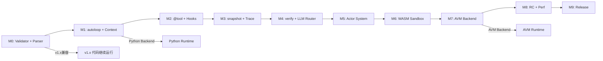

# Nexa v2.0 — Implementation Roadmap

> 本文档定义 Nexa v2.0 的分阶段实施路线图，包括里程碑定义、交付物清单、依赖关系、风险缓解策略，以及每个阶段的具体任务分解。

---

## 1. 总体实施策略

### 1.1 核心原则

**原则一：Python Runtime 先行，AVM 渐进迁移**

v2.0 的所有新功能首先在 Python Runtime 中实现和验证，确保语义正确性后再迁移到 AVM。这避免了"同时设计语言+实现运行时+重构编译器"的三重风险。

**原则二：每个里程碑可独立交付**

每个里程碑产出的代码都可以独立运行和测试，不存在"半成品不可用"的情况。

**原则三：v1.x 兼容性不可破坏**

所有 v1.x 代码在 `--harness=off` 模式下必须可以继续运行，零修改成本。

### 1.2 版本号策略

v2.0 采用渐进式版本号，每个里程碑对应一个可发布的版本：

| 里程碑 | 版本号 | 含义 |
|--------|--------|------|
| M0 | v2.0.0-alpha.1 | Harness Validator + 基础语法扩展 |
| M1 | v2.0.0-alpha.2 | Execution Engine (autoloop) + Context Manager |
| M2 | v2.0.0-alpha.3 | Tool Registry (@tool) + Lifecycle Hooks |
| M3 | v2.0.0-alpha.4 | State Store (snapshot/fork) + Trace System |
| M4 | v2.0.0-alpha.5 | Evaluation Interface (verify) + LLM Router |
| M5 | v2.0.0-alpha.6 | Actor System (spawn/pass/await) |
| M6 | v2.0.0-beta.1 | 全功能集成 + WASM Sandbox |
| M7 | v2.0.0-beta.2 | AVM Bytecode Backend |
| M8 | v2.0.0-rc.1 | Release Candidate — 全功能 + 性能优化 |
| M9 | v2.0.0 | 正式发布 |

---

## 2. 里程碑依赖关系图



---

## 3. 里程碑详细定义

### M0 — Harness Validator + 基础语法扩展

**目标**: 编译器能够解析 v2.0 新增语法，并在编译期执行 Harness 验证。

**交付物**:

| 交付物 | 文件 | 说明 |
|--------|------|------|
| Parser 扩展 | `src/nexa_parser.py` | 新增 ~28 条语法规则 + exclusion keywords |
| AST 节点 | `src/ast_transformer.py` | 新增 ~15 个 AST dataclass + ~15 个 handler |
| Harness Validator | `src/harness_validator.py` (新文件) | 完整的 Validator 类 + 8+ 条验证规则 |
| 消歧评分 | `src/ast_transformer.py` | _SCORE_TABLE 新增 ~15 条评分 |
| CLI 集成 | `src/cli.py` | 新增 `--harness` 参数 + `harness-check` 命令 |
| 测试 | `tests/test_harness_validator.py` (新文件) | 每条规则 2 个测试 (违规+合规) |

**任务分解**:

```
M0-T01: 在 nexa_grammar 中添加 %declare exclusion keywords (28个)
M0-T02: 添加 autoloop/with_context/try_agent 等语法规则到 nexa_grammar
M0-T03: 定义 ToolAnnotation/AutoLoopStmt/WithContextStmt 等 AST dataclass
M0-T04: 实现 tool_annotation/autoloop_stmt/with_context_stmt 等 handler
M0-T05: 更新 _SCORE_TABLE 消歧评分
M0-T06: 创建 harness_validator.py — HarnessValidator 类
M0-T07: 实现 E-001~E-005 验证规则 (autoloop)
M0-T08: 实现 T-001~T-004 验证规则 (@tool)
M0-T09: 实现 C-001~C-004 验证规则 (with_context)
M0-T10: 实现 EC-001~EC-003 验证规则 (try_agent)
M0-T11: 实现 S-001~S-004 验证规则 (snapshot/fork)
M0-T12: 实现 V-001~V-003 验证规则 (verify)
M0-T13: 实现 U-001~U-004 验证规则 (unharnessed)
M0-T14: 实现 H-001~H-002 验证规则 (harness agent 整体)
M0-T15: 实现 HarnessValidationReport 格式化输出
M0-T16: 集成 HarnessValidator 到编译管线 (cli.py)
M0-T17: 新增 --harness CLI 参数
M0-T18: 新增 harness-check 命令
M0-T19: 编写 test_harness_validator.py (每条规则 2 个测试)
M0-T20: 验证 v1.x 代码在 --harness=off 下零修改运行
```

**验收标准**:
- ✅ `nexa harness-check examples/01_hello_world.nx --harness=strict` 输出验证报告
- ✅ v1.x 代码在 `--harness=off` 下零修改运行
- ✅ 所有验证规则有对应的测试覆盖
- ✅ 新增语法规则可以正确解析

---

### M1 — Execution Engine (autoloop) + Context Manager

**目标**: Agent 可以通过 `autoloop` 进行自主 ReAct 循环，上下文自动管理。

**交付物**:

| 交付物 | 文件 | 说明 |
|--------|------|------|
| HarnessKernel | `src/runtime/harness_kernel.py` (新文件) | 核心调度器框架 |
| ExecutionEngine | `src/runtime/execution_engine.py` (新文件) | ReAct 循环引擎 |
| ContextManager | `src/runtime/context_manager.py` (新文件) | 上下文管理器 |
| ToolOutputStore | `src/runtime/tool_output_store.py` (新文件) | 工具输出转储 |
| Python Backend | `src/code_generator.py` | 增强 BOILERPLATE + autoloop/with_context 代码生成 |
| 示例 | `examples/20_harness_autoloop.nx` (新文件) | autoloop 完整示例 |
| 测试 | `tests/test_execution_engine.py` (新文件) | autoloop + context 测试 |

**任务分解**:

```
M1-T01: 创建 harness_kernel.py — HarnessKernel 类框架
M1-T02: 创建 execution_engine.py — ExecutionEngine 类
M1-T03: 实现 AutoLoopConfig/StepResult/AutoLoopResult 数据结构
M1-T04: 实现 run_loop() — ReAct 循环主逻辑
M1-T05: 实现 _execute_step() — 单步 Reason→Act→Observe→Reflect
M1-T06: 实现 _check_exit_condition() — 语义退出条件检查
M1-T07: 实现 _generate_correction_reflection() — 错误自纠错反思生成
M1-T08: 创建 context_manager.py — ContextManager 类
M1-T09: 实现 enter_scope/exit_scope — with_context 作用域管理
M1-T10: 实现 add_message/add_tool_result — 消息添加 + 工具输出卸载
M1-T11: 实现 _check_and_evict() — Token 溢出检测 + 三层压缩
M1-T12: 实现 _apply_sliding_window/_apply_smart_summarization — 压缩策略
M1-T13: 创建 tool_output_store.py — 工具输出文件转储
M1-T14: 增强 code_generator.py BOILERPLATE — 添加 Harness Runtime 导入
M1-T15: 实现 autoloop Python 代码生成
M1-T16: 实现 with_context Python 代码生成
M1-T17: 实现 try_agent/catch_correction Python 代码生成
M1-T18: 实现 reflect Python 代码生成
M1-T19: 创建 examples/20_harness_autoloop.nx — 完整示例
M1-T20: 编写 test_execution_engine.py — autoloop + context 测试
M1-T21: 验证 autoloop 可以自主执行 10+ 步任务
M1-T22: 验证 with_context 可以自动 eviction 防止 OOM
```

**验收标准**:
- ✅ `nexa run examples/20_harness_autoloop.nx --harness=warn` 可以自主执行
- ✅ autoloop 在 exit_when 条件满足时正确退出
- ✅ autoloop 在 max_steps 达到时正确退出
- ✅ try_agent/catch_correction 在 Tool 错误时触发自纠错
- ✅ with_context 在 Token 溢出时自动 eviction
- ✅ v1.x 代码在 `--harness=off` 下继续正常运行

---

### M2 — Tool Registry (@tool) + Lifecycle Hooks

**目标**: `@tool` 注解自动生成 Schema 并注入 LLM 上下文，Lifecycle Hooks 在 step/tool 执行前后拦截。

**交付物**:

| 交付物 | 文件 | 说明 |
|--------|------|------|
| ToolRegistry | `src/runtime/tool_registry.py` (新文件) | @tool 自动 Schema + 注册 + 执行 |
| LifecycleHookManager | `src/runtime/lifecycle_hooks.py` (新文件) | before/after/on_error 钩子 |
| HITLManager 增强 | `src/runtime/hitl.py` | Tool 执行审批流程 |
| Python Backend | `src/code_generator.py` | @tool + lifecycle hooks 代码生成 |
| 示例 | `examples/21_harness_tool_hooks.nx` (新文件) | @tool + hooks 示例 |
| 测试 | `tests/test_tool_registry.py` + `tests/test_lifecycle_hooks.py` | 新增测试 |

**任务分解**:

```
M2-T01: 创建 tool_registry.py — ToolRegistry 类
M2-T02: 实现 register_from_annotation() — 从 @tool 函数自动注册
M2-T03: 实现 _generate_schema() — 从函数签名自动生成 JSON Schema
M2-T04: 实现 execute() — Tool 执行 (含 HITL 检查)
M2-T05: 实现 get_schemas() — 获取所有 Schema (注入 LLM 上下文)
M2-T06: 创建 lifecycle_hooks.py — LifecycleHookManager 类
M2-T07: 实现 register/fire — 钩子注册和触发
M2-T08: 实现 fire_before_tool — Tool 调用前拦截 (权限检查)
M2-T09: 实现 fire_after_tool — Tool 调用后拦截 (结果验证)
M2-T10: 增强 hitl.py — Tool 执行审批流程
M2-T11: 实现 @tool Python 代码生成
M2-T12: 实现 lifecycle hooks Python 代码生成
M2-T13: 实现 DbC 契约 → Lifecycle Hooks 自动映射
M2-T14: 创建 examples/21_harness_tool_hooks.nx
M2-T15: 编写 test_tool_registry.py
M2-T16: 编写 test_lifecycle_hooks.py
M2-T17: 验证 @tool 自动 Schema 生成正确性
M2-T18: 验证 lifecycle hooks 在 step 前后正确触发
```

**验收标准**:
- ✅ `@tool` 函数自动生成正确的 JSON Schema
- ✅ `@tool` Schema 自动注入到使用该 tool 的 agent 的 LLM 上下文
- ✅ `risk_level=high` 的 tool 需要 HITL 审批才能执行
- ✅ `before_step`/`after_step` 钩子在正确时机触发
- ✅ `before_tool` 钩子可以拦截 Tool 调用
- ✅ v1.x `tool` 声明在 `--harness=off` 下继续正常工作

---

### M3 — State Store (snapshot/fork) + Trace System

**目标**: Agent 可以通过 `snapshot`/`restore`/`fork` 进行状态分支与回溯，思维轨迹自动记录。

**交付物**:

| 交付物 | 文件 | 说明 |
|--------|------|------|
| StateStore | `src/runtime/state_store.py` (新文件) | 三层存储 (COW + KV + Vector) |
| VectorStore | `src/runtime/vector_store.py` (新文件) | 简易向量存储 |
| TraceSystem | `src/runtime/trace_system.py` (新文件) | 思维轨迹追踪 |
| Python Backend | `src/code_generator.py` | snapshot/fork/trace 代码生成 |
| 示例 | `examples/22_harness_state_trace.nx` (新文件) | snapshot/fork/trace 示例 |
| 测试 | `tests/test_state_store.py` + `tests/test_trace_system.py` | 新增测试 |

**任务分解**:

```
M3-T01: 创建 state_store.py — StateStore 类 (三层存储)
M3-T02: 实现 snapshot/restore — COW 快照/回溯
M3-T03: 实现 fork — 多分支并行探索
M3-T04: 实现 store_experience/retrieve_experience — Vector Store 操作
M3-T05: 创建 vector_store.py — VectorStore 类
M3-T06: 实现 compute_embedding — embedding 计算
M3-T07: 实现 store/search — 文档存储和 cosine similarity 搜索
M3-T08: 创建 trace_system.py — TraceSystem 类
M3-T09: 实现 record_step — ReAct step 轨迹记录
M3-T10: 实现 record_reflection/record_error — 反思和错误记录
M3-T11: 实现 export_decision_tree/export_timeline — 导出格式
M3-T12: 实现 snapshot Python 代码生成
M3-T13: 实现 restore Python 代码生成
M3-T14: 实现 fork Python 代码生成
M3-T15: 实现 trace 导出 CLI 参数 (--trace-output)
M3-T16: 创建 examples/22_harness_state_trace.nx
M3-T17: 编写 test_state_store.py
M3-T18: 编写 test_trace_system.py
M3-T19: 验证 snapshot/restore 可以正确回溯状态
M3-T20: 验证 fork 可以并行探索并合并结果
M3-T21: 验证 trace 可以导出为决策树 JSON
```

**验收标准**:
- ✅ `snapshot` 创建 O(1) COW 快照
- ✅ `restore` 正确回溯到快照点
- ✅ `fork` 并行执行多个分支并合并结果
- ✅ Trace 导出为 decision_tree.json 格式
- ✅ Trace 导出为 timeline.json 格式
- ✅ Vector Store 可以存储和检索经验

---

### M4 — Evaluation Interface (verify) + LLM Router

**目标**: `verify` 语句在编译期+运行期双层验证，LLM Router 根据能力需求动态路由模型。

**交付物**:

| 交付物 | 文件 | 说明 |
|--------|------|------|
| EvaluationInterface | `src/runtime/evaluation_interface.py` (新文件) | 四层验证接口 |
| LLMRouter | `src/runtime/llm_router.py` (新文件) | 模型无关动态路由 |
| Python Backend | `src/code_generator.py` | verify 代码生成 |
| 示例 | `examples/23_harness_verify_router.nx` (新文件) | verify + router 示例 |
| 测试 | `tests/test_evaluation_interface.py` + `tests/test_llm_router.py` | 新增测试 |

**任务分解**:

```
M4-T01: 创建 evaluation_interface.py — EvaluationInterface 类
M4-T02: 实现 verify_satisfies — 类型合规性验证
M4-T03: 实现 verify_semantic — 语义验收
M4-T04: 实现 verify_behavioral — 行为轨迹验证
M4-T05: 实现 VerifyResult 数据结构 + correction_hint
M4-T06: 创建 llm_router.py — LLMRouter 类
M4-T07: 实现 MODEL_CAPABILITIES — 模型能力矩阵
M4-T08: 实现 route() — 根据能力需求动态路由
M4-T09: 实现 chat() — 统一 LLM 调用接口 + fallback chain
M4-T10: 实现 ModelRequirement 数据结构
M4-T11: 实现 verify Python 代码生成
M4-T12: 实现 LLM Router 集成到 ExecutionEngine
M4-T13: 替换 core.py 全局 client → LLMRouter
M4-T14: 创建 examples/23_harness_verify_router.nx
M4-T15: 编写 test_evaluation_interface.py
M4-T16: 编写 test_llm_router.py
M4-T17: 验证 verify 可以在 autoloop 内触发纠错循环
M4-T18: 验证 LLM Router 可以根据需求动态选择模型
```

**验收标准**:
- ✅ `verify result satisfies Protocol` 在运行期检查类型合规性
- ✅ `verify "condition" against result` 在运行期执行语义评估
- ✅ verify 失败时触发 reflect 自纠错（而非直接抛异常）
- ✅ LLM Router 根据能力需求选择最优模型
- ✅ LLM Router fallback chain 在主模型失败时自动切换
- ✅ v1.x 固定 model 字符串在 `--harness=off` 下继续工作

---

### M5 — Actor System (spawn/pass/await)

**目标**: 基于 Actor Model 的多 Agent 编排，支持 spawn/pass/await/receive。

**交付物**:

| 交付物 | 文件 | 说明 |
|--------|------|------|
| ActorSystem | `src/runtime/actor_system.py` (新文件) | Actor 编排系统 |
| Python Backend | `src/code_generator.py` | spawn/pass/await 代码生成 |
| 示例 | `examples/24_harness_actor.nx` (新文件) | Actor 示例 |
| 测试 | `tests/test_actor_system.py` (新文件) | Actor 测试 |

**任务分解**:

```
M5-T01: 创建 actor_system.py — ActorSystem 类
M5-T02: 实现 spawn — 创建子 Agent Actor
M5-T03: 实现 pass_message — 异步消息传递
M5-T04: 实现 await_result — 同步等待结果
M5-T05: 实现 receive — Actor 内部消息接收
M5-T06: 实现 ActorHandle 数据结构
M5-T07: 实现 _start_actor_loop — Actor 消息处理循环
M5-T08: 实现 spawn Python 代码生成
M5-T09: 实现 pass Python 代码生成
M5-T10: 实现 await Python 代码生成
M5-T11: 实现 receive Python 代码生成
M5-T12: 创建 examples/24_harness_actor.nx
M5-T13: 编写 test_actor_system.py
M5-T14: 验证 spawn/pass/await 可以正确编排多 Agent
M5-T15: 验证 Actor 消息传递不共享状态
```

**验收标准**:
- ✅ `spawn AgentName(args)` 创建子 Agent Actor
- ✅ `pass message to actor` 异步发送消息
- ✅ `await actor` 同步等待结果
- ✅ Actor 之间通过消息传递协作，不共享状态
- ✅ v1.x `join_agents`/`nexa_pipeline` 在 `--harness=off` 下继续工作

---

### M6 — WASM Sandbox + 全功能集成

**目标**: WASM 沙箱池实现，高风险 Tool 在沙箱中执行；所有 Harness 功能集成测试。

**交付物**:

| 交付物 | 文件 | 说明 |
|--------|------|------|
| SandboxPool | `src/runtime/sandbox_pool.py` (新文件) | WASM 沙箱预热池 (Python 版) |
| WASM Sandbox | `avm/src/wasm/sandbox.rs` (增强) | Rust WASM 沙箱实现 |
| 集成测试 | `tests/test_harness_integration.py` (新文件) | 全功能集成测试 |
| 示例 | `examples/25_harness_full_demo.nx` (新文件) | 完整 Harness Demo |
| 文档 | `docs/08_Harness_Native_Guide.md` (新文件) | Harness Native 使用指南 |

**任务分解**:

```
M6-T01: 创建 sandbox_pool.py — SandboxPool 类 (Python 版先用 subprocess)
M6-T02: 实现 acquire/release — 沙箱分配和回收
M6-T03: 增强 avm/src/wasm/sandbox.rs — 完整 WASM 沙箱实现
M6-T04: 实现 WasmResourceLimits — 资源限制配置
M6-T05: 实现 Host FFI — stdin/stdout/fs/net 接口
M6-T06: 集成 SandboxPool 到 ToolRegistry
M6-T07: 全功能集成测试 — autoloop + @tool + with_context + try_agent + snapshot + fork + verify + hooks + trace + actor
M6-T08: 创建 examples/25_harness_full_demo.nx — 类似 Claude Code 的完整示例
M6-T09: 编写 test_harness_integration.py — 全功能集成测试
M6-T10: 编写 docs/08_Harness_Native_Guide.md — 用户指南
M6-T11: 验证高风险 Tool 在沙箱中执行
M6-T12: 验证沙箱资源限制生效 (CPU/内存/时间)
M6-T13: 验证全功能集成 — 从 .nx 到运行结果的完整流程
```

**验收标准**:
- ✅ `risk_level=high` 的 Tool 在 WASM 沙箱中执行
- ✅ 沙箱资源限制生效（CPU 时间、内存、文件系统）
- ✅ 沙箱预热池分配延迟 <1s
- ✅ 全功能集成测试通过（autoloop + @tool + with_context + try_agent + snapshot + fork + verify + hooks + trace + actor）
- ✅ 完整的 Claude Code 级别 Agent 示例可以运行

---

### M7 — AVM Bytecode Backend

**目标**: v2.0 语法可以编译为 AVM 字节码并在 Rust AVM 中执行。

**交付物**:

| 交付物 | 文件 | 说明 |
|--------|------|------|
| OpCode 扩展 | `avm/src/bytecode/instructions.rs` | 新增 ~50 条 Harness 指令 |
| BytecodeMetadata 扩展 | `avm/src/bytecode/instructions.rs` | Harness 配置 Metadata |
| AVMBytecodeBackend | `src/code_generator.py` (新增后端) | AVM 字节码生成 |
| AVM Interpreter 增强 | `avm/src/vm/interpreter.rs` | 支持 Harness 指令执行 |
| Harness Runtime (Rust) | `avm/src/runtime/` | 六元组 Rust 实现 |
| 测试 | `avm/` + `tests/test_avm_backend.py` | AVM 测试 |

**任务分解**:

```
M7-T01: 扩展 OpCode enum — 新增 ~50 条 Harness 指令
M7-T02: 扩展 BytecodeMetadata — Harness 配置字段
M7-T03: 实现 AVMBytecodeBackend — 字节码生成类
M7-T04: 实现 @tool → ToolRegister/ToolRegisterSchema 指令生成
M7-T05: 实现 autoloop → AutoLoopStart/Step/CheckExit/End 指令生成
M7-T06: 实现 with_context → ContextEnterScope/ExitScope 指令生成
M7-T07: 实现 try_agent → TryAgentStart/End + CatchCorrection 指令生成
M7-T08: 实现 snapshot/restore/fork → StateSnapshot/Restore/Fork 指令生成
M7-T09: 实现 verify → VerifySatisfies/Method/Semantic 指令生成
M7-T10: 实现 reflect → Reflect 指令生成
M7-T11: 实现 lifecycle hooks → HookRegister/Fire 指令生成
M7-T12: 实现 spawn/pass/await → ActorSpawn/Pass/Await 指令生成
M7-T13: 实现 trace → TraceRecord 指令生成
M7-T14: 增强 AVM Interpreter — 支持 Harness 指令执行
M7-T15: 实现 HarnessKernel (Rust) — 六元组 Rust 实现
M7-T16: 实现 ExecutionEngine (Rust) — ReAct 循环 Rust 实现
M7-T17: 实现 ContextManager (Rust) — 上下文管理 Rust 实现
M7-T18: 实现 ToolRegistry (Rust) — Tool 注册 Rust 实现
M7-T19: 实现 StateStore (Rust) — COW + KV Rust 实现
M7-T20: 实现 LifecycleHooks (Rust) — 钩子 Rust 实现
M7-T21: 实现 EvaluationInterface (Rust) — 验证 Rust 实现
M7-T22: 实现 LLMRouter (Rust) — 路由 Rust 实现
M7-T23: 实现 ActorSystem (Rust) — Actor Rust 实现
M7-T24: 实现 TraceSystem (Rust) — Trace Rust 实现
M7-T25: 编写 test_avm_backend.py — AVM 字节码生成测试
M7-T26: cargo test — AVM 运行时测试
M7-T27: 验证 .nx → AVM 字节码 → Rust 执行的完整流程
```

**验收标准**:
- ✅ v2.0 .nx 文件可以编译为 AVM 字节码
- ✅ AVM 字节码可以在 Rust AVM 中正确执行
- ✅ AVM 执行 autoloop ReAct 循环
- ✅ AVM 执行 @tool Tool 调用
- ✅ AVM 执行 with_context 上下文管理
- ✅ AVM 性能指标达到设计目标 (编译 ~5ms, 启动 ~10ms, 内存 ~10MB)

---

### M8 — Release Candidate + 性能优化

**目标**: 全功能 + 性能优化 + 文档完善 + Bug 修复。

**交付物**:

| 交付物 | 文件 | 说明 |
|--------|------|------|
| 性能优化 | 多文件 | AVM 性能优化 + Python Runtime 优化 |
| 文档更新 | `docs/` | 语法参考 + 编译器架构 + 快速入门 更新 |
| Bug 修复 | 多文件 | 集成测试发现的 Bug |
| 迁移指南 | `docs/09_v1_to_v2_migration.md` (新文件) | v1.x → v2.0 迁移指南 |
| Release Notes | `docs/release_notes/v2.0.0.md` (新文件) | v2.0.0 Release Notes |

**任务分解**:

```
M8-T01: AVM 性能优化 — 编译时间 <5ms 目标
M8-T02: AVM 性能优化 — 启动时间 <10ms 目标
M8-T03: AVM 性能优化 — 内存占用 <10MB 目标
M8-T04: Python Runtime 性能优化 — autoloop 循环效率
M8-T05: Python Runtime 性能优化 — Context Manager eviction 效率
M8-T06: 更新 docs/01_nexa_syntax_reference.md — v2.0 语法
M8-T07: 更新 docs/02_compiler_architecture.md — v2.0 编译器架构
M8-T08: 更新 docs/06_quick_start_guide.md — v2.0 快速入门
M8-T09: 更新 docs/07_Developer_Guidance.md — v2.0 开发者指南
M8-T10: 创建 docs/08_Harness_Native_Guide.md — Harness Native 使用指南
M8-T11: 创建 docs/09_v1_to_v2_migration.md — 迁移指南
M8-T12: 修复集成测试发现的 Bug
M8-T13: 创建 docs/release_notes/v2.0.0.md
M8-T14: 全量回归测试 — v1.x 所有示例 + v2.0 所有示例
M8-T15: 性能基准测试 — AVM vs Python Runtime 对比
```

**验收标准**:
- ✅ AVM 编译时间 <5ms (简单文件)
- ✅ AVM 启动时间 <10ms
- ✅ AVM 内存占用 <10MB (空闲状态)
- ✅ 所有 v1.x 示例在 `--harness=off` 下正常运行
- ✅ 所有 v2.0 示例在 `--harness=warn` 下正常运行
- ✅ 所有 v2.0 示例在 `--harness=strict` 下通过 Harness 验证
- ✅ 文档完整更新

---

### M9 — 正式发布

**目标**: v2.0.0 正式发布。

**交付物**:

| 交付物 | 说明 |
|--------|------|
| VERSION 文件更新 | `2.0.0` |
| Git Tag | `v2.0.0` |
| GitHub Release | Release Notes + 二进制包 |
| PyPI 发布 | `nexa==2.0.0` |
| crates.io 发布 | `nexa-avm==2.0.0` |

**任务分解**:

```
M9-T01: 更新 VERSION 文件为 2.0.0
M9-T02: 更新 src/_version.py 版本读取
M9-T03: 更新 avm/Cargo.toml 版本号
M9-T04: 更新 setup.py 版本号
M9-T05: 最终全量回归测试
M9-T06: 创建 git tag v2.0.0
M9-T07: 创建 GitHub Release
M9-T08: 发布到 PyPI
M9-T09: 发布到 crates.io (AVM)
M9-T10: 更新 README.md — v2.0 特性介绍
```

---

## 4. 风险缓解策略

### 4.1 技术风险缓解

| 风险 | 缓解策略 | 触发条件 |
|------|---------|---------|
| Parser 语法冲突 | 上下文敏感解析 + exclusion keyword + 渐进式添加 | 新关键字与 v1.x IDENTIFIER 冲突 |
| Harness Validator 规则过严 | `--harness=warn` 降级 + `unharnessed` 绕过 | 开发者反馈验证规则阻碍开发 |
| autoloop 死循环 | `max_steps` 硬上限 + `timeout` + 不可恢复错误退出 | Agent 在 200 步内未退出 |
| Context Manager eviction 丢失关键信息 | `preserve_recent` 保留最近 N 轮 + importance_weighted 策略 | eviction 后 Agent 行为异常 |
| WASM 沙箱性能开销 | 预热池 + 热路径 bypass (低风险 Tool 不进沙箱) | Tool 执行延迟 >100ms |
| AVM 字节码后端开发周期长 | Python Backend 先行 + AVM 渐进迁移 | AVM 开发阻塞整体进度 |
| LLM Router 动态路由不稳定 | 确定性 fallback + 固定 model 字符串兼容 | 路由选择导致 Agent 行为不一致 |

### 4.2 进度风险缓解

| 风险 | 缓解策略 |
|------|---------|
| M0-M3 开发周期过长 | 每个里程碑独立交付，不阻塞后续里程碑的规划 |
| AVM Backend (M7) 延迟 | M0-M6 全部基于 Python Runtime，AVM 是增量而非前提 |
| 测试覆盖不足 | 每个里程碑定义明确的验收标准，未达标不进入下一里程碑 |
| 文档滞后 | 每个里程碑包含文档更新任务，不单独设立文档里程碑 |

---

## 5. 并行工作策略

### 5.1 可并行的工作流

以下工作流可以在不同里程碑期间并行推进：

```
┌─────────────────────────────────────────────────────────────────────┐
│  Workstream A: Language & Compiler (Python Backend)                  │
│  M0 → M1 → M2 → M3 → M4 → M5 → M6                                  │
│  (优先级最高，所有里程碑的前置依赖)                                    │
├─────────────────────────────────────────────────────────────────────┤
│  Workstream B: AVM Runtime (Rust)                                    │
│  M7 (在 M6 完成后开始)                                               │
│  (优先级次高，依赖 Workstream A 的语义验证)                           │
├─────────────────────────────────────────────────────────────────────┤
│  Workstream C: Documentation & Examples                              │
│  与每个里程碑同步推进                                                 │
│  (优先级中，不阻塞开发但必须同步完成)                                  │
├─────────────────────────────────────────────────────────────────────┤
│  Workstream D: WASM Sandbox (Rust)                                   │
│  M6-T03~T06 (可与 M5 并行开始 Rust 部分)                             │
│  (优先级中低，Python 版先用 subprocess 替代)                         │
└─────────────────────────────────────────────────────────────────────┘
```

### 5.2 里程碑间的时间缓冲

每个里程碑之间预留缓冲期，用于：
- 修复前一个里程碑的遗留 Bug
- 完善测试覆盖
- 更新文档
- 代码审查

---

## 6. 测试策略总览

### 6.1 测试金字塔

```
┌──────────────────────────────────────────────────────────────┐
│                    L6 — AVM Integration Tests                  │
│                    (cargo test + AVM end-to-end)               │
├──────────────────────────────────────────────────────────────┤
│                L5 — End-to-End Tests                           │
│                (.nx → Python → 运行 → 结果验证)                │
├──────────────────────────────────────────────────────────────┤
│            L4 — Code Generation Tests                         │
│            (AST → Python 代码 → 代码结构验证)                  │
├──────────────────────────────────────────────────────────────┤
│        L3 — Harness Validator Tests                           │
│        (AST → 验证报告 → 规则覆盖)                             │
├──────────────────────────────────────────────────────────────┤
│    L2 — AST Transformer Tests                                │
│    (Parse Tree → AST 节点 → 类型/字段验证)                    │
├──────────────────────────────────────────────────────────────┤
│  L1 — Parser Tests                                           │
│  (源码 → Parse Tree → 规则覆盖)                               │
└──────────────────────────────────────────────────────────────┘
```

### 6.2 每个里程碑的测试要求

| 里程碑 | 最低测试数量 | 关键测试 |
|--------|------------|---------|
| M0 | 30+ | 每条 Harness 规则 2 个测试 (违规+合规) |
| M1 | 20+ | autoloop 退出条件 + context eviction |
| M2 | 15+ | @tool Schema 生成 + hooks 触发时机 |
| M3 | 15+ | snapshot/restore + fork/merge + trace 导出 |
| M4 | 10+ | verify 双层验证 + LLM Router 路由选择 |
| M5 | 10+ | spawn/pass/await + Actor 消息传递 |
| M6 | 30+ | 全功能集成 + WASM 沙箱资源限制 |
| M7 | 20+ | AVM 字节码生成 + Rust 运行时 |
| M8 | 50+ | 全量回归 + 性能基准 |

---

## 7. 文档交付计划

| 里程碑 | 文档交付物 |
|--------|----------|
| M0 | Harness Validator 设计文档 (本规划文档已覆盖) |
| M1 | Execution Engine + Context Manager 设计文档 |
| M2 | @tool + Lifecycle Hooks 设计文档 |
| M3 | State Store + Trace System 设计文档 |
| M4 | Evaluation Interface + LLM Router 设计文档 |
| M5 | Actor System 设计文档 |
| M6 | `docs/08_Harness_Native_Guide.md` — 用户指南 |
| M7 | AVM Backend 设计文档 |
| M8 | `docs/09_v1_to_v2_migration.md` — 迁移指南 |
| M8 | 更新 `docs/01~07` 所有文档到 v2.0 |
| M9 | `docs/release_notes/v2.0.0.md` — Release Notes |

---

## 8. 关键指标与成功标准

### 8.1 功能指标

| 指标 | 目标 | 测量方式 |
|------|------|---------|
| v1.x 兼容性 | 100% v1.x 代码零修改运行 | 所有 v1.x examples 在 `--harness=off` 下通过 |
| Harness 验证覆盖率 | 8+ 条编译期规则 | HarnessValidator 规则数量 |
| autoloop 最大步数 | 200 步无崩溃 | 压力测试 |
| context eviction | Token 溢出自动压缩，不 OOM | 长上下文压力测试 |
| @tool Schema 自动生成 | 100% 从函数签名生成 | Schema 正确性测试 |
| trace 导出 | decision_tree + timeline 两种格式 | 导出格式测试 |

### 8.2 性能指标

| 指标 | Python Runtime | AVM Runtime |
|------|---------------|-------------|
| 编译时间 | ~100ms | ~5ms |
| 启动时间 | ~500ms | ~10ms |
| 内存占用 | ~100MB | ~10MB |
| 并发 Agents | ~100 | ~10000 |
| autoloop step 延迟 | ~1s/step | ~100ms/step |
| WASM 沙箱分配 | <1s (预热池) | <1s (预热池) |

### 8.3 用户体验指标

| 指标 | 目标 |
|------|------|
| v1.x → v2.0 迁移成本 | 零修改即可运行 (`--harness=off`) |
| Harness 学习曲线 | 从 `unharnessed` 开始，渐进增强 |
| 错误信息可读性 | Harness 验证报告清晰指出违规位置和修复建议 |
| trace 可视化 | `nexa trace-view` 输出 ASCII 决策树 |

---

## 9. 里程碑回顾与调整机制

### 9.1 每个里程碑结束时的回顾

每个里程碑完成后执行以下回顾：

1. **验收标准检查**: 所有验收标准是否通过？
2. **测试覆盖检查**: 最低测试数量是否达标？
3. **v1.x 兼容性检查**: v1.x 代码是否仍然正常运行？
4. **文档同步检查**: 文档是否与代码同步？
5. **风险回顾**: 是否有新发现的风险需要调整计划？
6. **下一里程碑调整**: 是否需要调整下一里程碑的任务分解？

### 9.2 计划调整原则

- **可以调整**: 里程碑内的任务分解、优先级排序、实现细节
- **不可调整**: v1.x 兼容性要求、Harness 六元组完整性、验收标准的核心条款
- **需要讨论**: 新增里程碑、删除里程碑、里程碑顺序调整

---

## 10. 总结

Nexa v2.0 的实施路线图遵循"Python Runtime 先行、AVM 渐进迁移、每个里程碑可独立交付"的核心策略，通过 9 个里程碑从 M0（编译器基础）到 M9（正式发布）逐步实现 Harness Native 的完整愿景。

关键路径是 **M0 → M1 → M2 → M3 → M4 → M5 → M6**（Python Runtime 全功能），然后 **M7**（AVM Backend）和 **M8**（RC + 优化），最终 **M9**（发布）。

每个里程碑都有明确的交付物、任务分解、验收标准和测试要求，确保实施过程可控、可追溯、可调整。